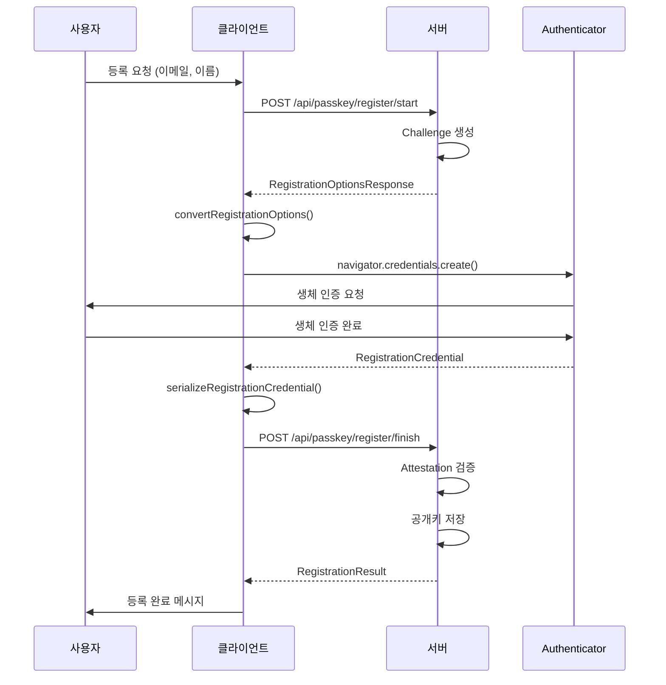
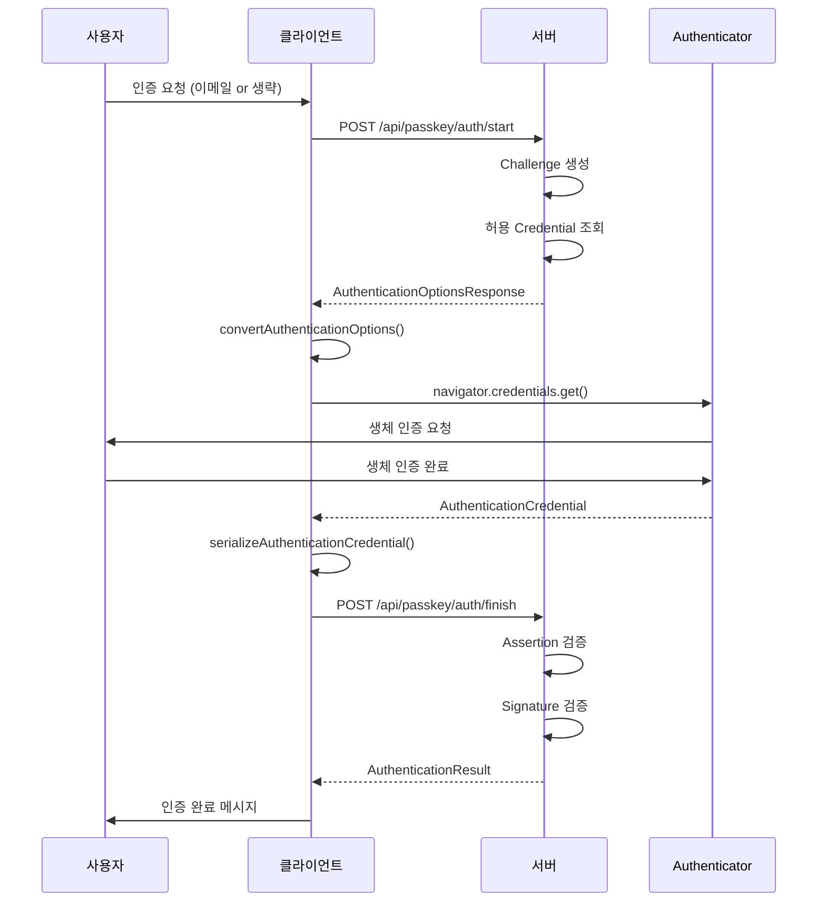

# FIDO2 Passkey 클라이언트-서버 연동 가이드

> FIDO2 Passkey 클라이언트와 백엔드 서버를 연동하기 위한 필수 확인 사항 및 연동 가이드

## 📋 목차
- [환경 설정](#환경-설정)
- [API 엔드포인트](#api-엔드포인트)
- [데이터 구조](#데이터-구조)
- [연동 절차](#연동-절차)
- [필수 확인 사항](#필수-확인-사항)
- [테스트 방법](#테스트-방법)

---

## 🔧 환경 설정

### 1. 서버 설정 확인

#### QA 환경 설정 파일: `.env.qa`
```bash
# Vite 개발 서버 포트 (프론트엔드)
VITE_PORT=8003

# FIDO2 백엔드 서버 URL
VITE_API_BASE_URL=https://localhost:8005

# 환경 이름
VITE_ENV_NAME=qa
```

**중요 사항:**
- 프론트엔드: `https://localhost:8003`
- 백엔드 서버: `https://localhost:8005`
- HTTPS 필수 (FIDO2 보안 요구사항)

#### RHEL 8.1 환경 추가 설정
```bash
# 1. 방화벽 포트 개방
sudo firewall-cmd --zone=public --add-port=8005/tcp --permanent
sudo firewall-cmd --reload

# 2. SELinux 포트 허용
sudo semanage port -a -t http_port_t -p tcp 8005

# 3. SSL 인증서 확인
# 서버가 유효한 SSL 인증서를 사용하는지 확인
```

### 2. 클라이언트 설정 코드

**파일 위치:** `src/services/api.ts:17-20`

```typescript
const DEFAULT_CONFIG: ApiConfig = {
  baseUrl: 'http://localhost:8080',  // 기본값
  timeout: 30000,                     // 30초
};
```

**설정 변경 방법:**
```typescript
import { setApiConfig } from './services/api';

// 런타임에 서버 URL 변경
setApiConfig({
  baseUrl: 'https://localhost:8005',
  timeout: 30000
});
```

---

## 🌐 API 엔드포인트

### 1. 등록 (Registration) API

#### 1.1 등록 시작
**파일:** `src/services/api.ts:129-137`

```http
POST /api/passkey/register/start
Content-Type: application/json
```

**Request Body:**
```json
{
  "username": "user@example.com",
  "displayName": "홍길동"
}
```

**Response:** `RegistrationOptionsResponse`
```json
{
  "challenge": "dGVzdC1jaGFsbGVuZ2U",
  "rp": {
    "name": "CROSSCERT FIDO2",
    "id": "localhost"
  },
  "user": {
    "id": "dXNlci0xMjM0NTY",
    "name": "user@example.com",
    "displayName": "홍길동"
  },
  "pubKeyCredParams": [
    { "type": "public-key", "alg": -7 },
    { "type": "public-key", "alg": -257 }
  ],
  "timeout": 60000,
  "attestation": "none",
  "authenticatorSelection": {
    "authenticatorAttachment": "platform",
    "residentKey": "required",
    "userVerification": "required"
  },
  "excludeCredentials": []
}
```

#### 1.2 등록 완료
**파일:** `src/services/api.ts:143-151`

```http
POST /api/passkey/register/finish
Content-Type: application/json
```

**Request Body:** `RegistrationCredential`
```json
{
  "id": "credential-id-base64url",
  "rawId": "credential-raw-id-base64url",
  "response": {
    "clientDataJSON": "client-data-base64url",
    "attestationObject": "attestation-object-base64url"
  },
  "type": "public-key",
  "authenticatorAttachment": "platform"
}
```

**Response:** `RegistrationResult`
```json
{
  "success": true,
  "credentialId": "credential-id",
  "message": "등록이 완료되었습니다."
}
```

### 2. 인증 (Authentication) API

#### 2.1 인증 시작
**파일:** `src/services/api.ts:161-169`

```http
POST /api/passkey/auth/start
Content-Type: application/json
```

**Request Body:** `AuthStartRequest`
```json
{
  "username": "user@example.com"  // Optional: Discoverable Credential 사용 시 생략 가능
}
```

**Response:** `AuthenticationOptionsResponse`
```json
{
  "challenge": "YXV0aC1jaGFsbGVuZ2U",
  "timeout": 60000,
  "rpId": "localhost",
  "userVerification": "preferred",
  "allowCredentials": [
    {
      "type": "public-key",
      "id": "credential-id-base64url",
      "transports": ["internal", "usb", "nfc", "ble"]
    }
  ]
}
```

#### 2.2 인증 완료
**파일:** `src/services/api.ts:175-183`

```http
POST /api/passkey/auth/finish
Content-Type: application/json
```

**Request Body:** `AuthenticationCredential`
```json
{
  "id": "credential-id-base64url",
  "rawId": "credential-raw-id-base64url",
  "response": {
    "clientDataJSON": "client-data-base64url",
    "authenticatorData": "authenticator-data-base64url",
    "signature": "signature-base64url",
    "userHandle": "user-handle-base64url"
  },
  "type": "public-key",
  "authenticatorAttachment": "platform"
}
```

**Response:** `AuthenticationResult`
```json
{
  "success": true,
  "username": "user@example.com",
  "message": "인증이 완료되었습니다."
}
```

---

## 📦 데이터 구조

### TypeScript 타입 정의

#### Request 타입
**파일:** `src/types/api.ts`

```typescript
// 등록 시작 요청
export interface RegisterStartRequest {
  username: string;
  displayName?: string;
}

// 인증 시작 요청
export interface AuthStartRequest {
  username?: string;  // Discoverable Credential 사용 시 생략 가능
}
```

#### Response 타입
**파일:** `src/types/webauthn.ts`

```typescript
// 등록 옵션 응답
export interface RegistrationOptionsResponse {
  challenge: string; // Base64URL encoded
  rp: {
    name: string;
    id: string;
  };
  user: {
    id: string; // Base64URL encoded
    name: string;
    displayName: string;
  };
  pubKeyCredParams: Array<{
    type: 'public-key';
    alg: number;  // -7 (ES256), -257 (RS256)
  }>;
  timeout?: number;
  attestation?: 'none' | 'indirect' | 'direct';
  authenticatorSelection?: {
    authenticatorAttachment?: 'platform' | 'cross-platform';
    residentKey?: 'discouraged' | 'preferred' | 'required';
    requireResidentKey?: boolean;
    userVerification?: 'required' | 'preferred' | 'discouraged';
  };
  excludeCredentials?: Array<{
    type: 'public-key';
    id: string; // Base64URL encoded
    transports?: Array<'usb' | 'nfc' | 'ble' | 'internal'>;
  }>;
}

// 인증 옵션 응답
export interface AuthenticationOptionsResponse {
  challenge: string; // Base64URL encoded
  timeout?: number;
  rpId?: string;
  userVerification?: 'required' | 'preferred' | 'discouraged';
  allowCredentials?: Array<{
    type: 'public-key';
    id: string; // Base64URL encoded
    transports?: Array<'usb' | 'nfc' | 'ble' | 'internal'>;
  }>;
}

// 등록 결과
export interface RegistrationResult {
  success: boolean;
  credentialId?: string;
  message?: string;
}

// 인증 결과
export interface AuthenticationResult {
  success: boolean;
  username?: string;
  message?: string;
}
```

#### Credential 타입
**파일:** `src/types/webauthn.ts:50-75`

```typescript
// 등록 시 서버로 전송하는 Credential
export interface RegistrationCredential {
  id: string;
  rawId: string; // Base64URL encoded
  response: {
    clientDataJSON: string; // Base64URL encoded
    attestationObject: string; // Base64URL encoded
  };
  type: 'public-key';
  clientExtensionResults?: AuthenticationExtensionsClientOutputs;
  authenticatorAttachment?: string;
}

// 인증 시 서버로 전송하는 Credential
export interface AuthenticationCredential {
  id: string;
  rawId: string; // Base64URL encoded
  response: {
    clientDataJSON: string; // Base64URL encoded
    authenticatorData: string; // Base64URL encoded
    signature: string; // Base64URL encoded
    userHandle?: string; // Base64URL encoded (사용자 ID)
  };
  type: 'public-key';
  clientExtensionResults?: AuthenticationExtensionsClientOutputs;
  authenticatorAttachment?: string;
}
```

---

## 🔄 연동 절차

### 1. 등록 플로우



**클라이언트 코드 흐름:**

1. **등록 시작 요청** (`src/services/api.ts:129-137`)
```typescript
const serverOptions = await registerStart({
  username: 'user@example.com',
  displayName: '홍길동'
});
```

2. **옵션 변환** (`src/services/webauthn.ts:346-389`)
```typescript
const options = convertRegistrationOptions(serverOptions);
// Base64URL 문자열 → ArrayBuffer 변환
```

3. **Credential 생성** (`src/services/webauthn.ts:548-592`)
```typescript
const credential = await navigator.credentials.create({
  publicKey: options
});
```

4. **Credential 직렬화** (`src/services/webauthn.ts:594-649`)
```typescript
const serializedCredential = serializeRegistrationCredential(credential);
// ArrayBuffer → Base64URL 문자열 변환
```

5. **등록 완료 요청** (`src/services/api.ts:143-151`)
```typescript
const result = await registerFinish(serializedCredential);
```

### 2. 인증 플로우



**클라이언트 코드 흐름:**

1. **인증 시작 요청** (`src/services/api.ts:161-169`)
```typescript
// 방법 1: 특정 사용자 인증
const serverOptions = await authStart({ username: 'user@example.com' });

// 방법 2: Discoverable Credential (사용자 선택)
const serverOptions = await authStart({});
```

2. **옵션 변환** (`src/services/webauthn.ts:471-502`)
```typescript
const options = convertAuthenticationOptions(serverOptions);
```

3. **Credential 가져오기** (`src/services/webauthn.ts:704-750`)
```typescript
const credential = await navigator.credentials.get({
  publicKey: options
});
```

4. **Credential 직렬화** (`src/services/webauthn.ts:752-814`)
```typescript
const serializedCredential = serializeAuthenticationCredential(credential);
```

5. **인증 완료 요청** (`src/services/api.ts:175-183`)
```typescript
const result = await authFinish(serializedCredential);
```

---

## ✅ 필수 확인 사항

### 1. 서버 측 구현 체크리스트

#### Challenge 생성 및 검증
- [ ] 등록/인증 시작 시 랜덤 Challenge 생성 (최소 16바이트)
- [ ] Challenge를 세션/DB에 저장하여 완료 요청 시 검증
- [ ] Challenge는 일회성으로 사용 후 폐기
- [ ] Challenge 유효 시간 설정 (권장: 5분)

#### Base64URL 인코딩/디코딩
- [ ] 모든 바이너리 데이터는 Base64URL 인코딩
- [ ] `+`, `/`, `=` 문자를 사용하지 않는 Base64URL 표준 준수
- [ ] 클라이언트가 보낸 Base64URL 문자열을 정확히 디코딩

#### 등록 검증 (register/finish)
- [ ] clientDataJSON 검증
  - [ ] type이 "webauthn.create"인지 확인
  - [ ] challenge가 서버가 생성한 것과 일치하는지 확인
  - [ ] origin이 예상 도메인과 일치하는지 확인
- [ ] attestationObject 검증
  - [ ] authData 파싱 및 검증
  - [ ] 공개키 추출 및 저장
  - [ ] counter 값 저장 (재생 공격 방지)
- [ ] 중복 등록 방지
  - [ ] 동일한 credentialId가 이미 존재하는지 확인

#### 인증 검증 (auth/finish)
- [ ] clientDataJSON 검증
  - [ ] type이 "webauthn.get"인지 확인
  - [ ] challenge 일치 확인
  - [ ] origin 일치 확인
- [ ] authenticatorData 검증
  - [ ] rpIdHash 검증
  - [ ] user present 플래그 확인
  - [ ] user verified 플래그 확인 (userVerification이 required인 경우)
  - [ ] counter 값 증가 확인 (재생 공격 방지)
- [ ] signature 검증
  - [ ] 저장된 공개키로 서명 검증
  - [ ] authenticatorData + clientDataJSON 해시값으로 검증

#### RP ID 설정
- [ ] 서버의 도메인과 일치하는 RP ID 설정
- [ ] localhost: "localhost" 사용
- [ ] 프로덕션: "example.com" (서브도메인 포함 가능)

#### CORS 설정
```javascript
// 예시: Express.js
app.use(cors({
  origin: 'https://localhost:8003',
  credentials: true
}));
```

### 2. 네트워크 요구사항

#### HTTPS 필수
- [ ] 프로덕션 환경에서 HTTPS 사용 (필수)
- [ ] localhost는 HTTP 허용 (개발 환경)
- [ ] 유효한 SSL/TLS 인증서 설치

#### 포트 및 방화벽
- [ ] 백엔드 포트 개방 (예: 8005)
- [ ] 방화벽 규칙 설정
- [ ] SELinux 정책 설정 (RHEL)

### 3. 클라이언트 설정 확인

#### 환경변수 설정
**파일:** `.env.qa`
```bash
VITE_API_BASE_URL=https://localhost:8005  # 서버 URL 확인
```

#### API 클라이언트 초기화
**파일:** `src/hooks/useFido2Api.ts:100-119`
```typescript
useEffect(() => {
  setApiConfig({
    baseUrl: config.serverUrl,  // 서버 URL 동기화
    timeout: config.timeout
  });
}, [config.serverUrl, config.timeout]);
```

### 4. 데이터 포맷 확인

#### Base64URL 인코딩 규칙
```typescript
// 올바른 Base64URL (클라이언트 → 서버)
"dGVzdC1jaGFsbGVuZ2U"  // ✅ +, /, = 없음

// 잘못된 Base64 (표준 Base64)
"dGVzdC1jaGFsbGVuZ2U="  // ❌ = 패딩 포함
"dGVzdC1jaGFsbGVuZ2U+"  // ❌ + 문자 포함
```

**클라이언트 인코딩/디코딩 함수:**
- `src/services/encoding.ts:arrayBufferToBase64Url()` - ArrayBuffer → Base64URL
- `src/services/encoding.ts:base64UrlToArrayBuffer()` - Base64URL → ArrayBuffer

---

## 🧪 테스트 방법

### 1. 서버 연결 테스트

**파일:** `src/services/api.ts:192-221`

```typescript
import { checkServerConnection } from './services/api';

// 서버 연결 상태 확인
const isConnected = await checkServerConnection();
if (!isConnected) {
  console.error('서버에 연결할 수 없습니다.');
}
```

**테스트 방법:**
```bash
# 서버가 8005 포트에서 실행 중인지 확인
curl -k https://localhost:8005/api/passkey/register/start -X OPTIONS

# 200 또는 405 응답이면 정상
```

### 2. 등록 플로우 테스트

#### 단계 1: 등록 시작 요청
```bash
curl -k -X POST https://localhost:8005/api/passkey/register/start \
  -H "Content-Type: application/json" \
  -d '{
    "username": "test@example.com",
    "displayName": "테스트 사용자"
  }'
```

**예상 응답:**
```json
{
  "challenge": "랜덤-base64url-문자열",
  "rp": { "name": "...", "id": "localhost" },
  "user": { ... },
  "pubKeyCredParams": [ ... ]
}
```

#### 단계 2: 브라우저에서 전체 플로우 테스트
1. 개발 서버 실행: `npm run dev:qa`
2. 브라우저에서 `https://localhost:8003` 접속
3. 회원가입 페이지로 이동
4. 이메일, 이름 입력 후 등록 시도
5. 브라우저 개발자 도구에서 네트워크 탭 확인
   - POST /api/passkey/register/start 요청 확인
   - POST /api/passkey/register/finish 요청 확인

### 3. 인증 플로우 테스트

#### 단계 1: 인증 시작 요청
```bash
curl -k -X POST https://localhost:8005/api/passkey/auth/start \
  -H "Content-Type: application/json" \
  -d '{
    "username": "test@example.com"
  }'
```

**예상 응답:**
```json
{
  "challenge": "랜덤-base64url-문자열",
  "rpId": "localhost",
  "allowCredentials": [ ... ]
}
```

#### 단계 2: 브라우저에서 전체 플로우 테스트
1. 로그인 페이지로 이동
2. 이메일 입력 후 로그인 시도
3. 생체 인증 프롬프트 확인
4. 네트워크 탭에서 API 요청/응답 확인

### 4. 디버깅 로그 활성화

**파일:** `src/utils/logger.ts`

클라이언트는 상세한 디버깅 로그를 제공합니다:
- API 요청/응답 로그
- WebAuthn 옵션 변환 로그
- Credential 생성/검증 로그
- Base64URL 인코딩/디코딩 로그

**브라우저 콘솔 확인:**
```javascript
// 전체 로그 확인
console.log('등록/인증 과정의 모든 로그 출력')

// 그룹화된 로그
[API 요청] → [WebAuthn 변환] → [Credential 생성] → [API 응답]
```

### 5. 에러 처리 확인

#### 일반적인 에러 시나리오

**서버 연결 실패:**
```typescript
// 예상 에러: "요청 시간이 초과되었습니다."
// 원인: 서버 미실행 또는 방화벽 차단
// 해결: 서버 상태 및 포트 확인
```

**Challenge 불일치:**
```typescript
// 예상 에러: "API 오류 (400): Challenge mismatch"
// 원인: 서버의 Challenge 검증 실패
// 해결: Challenge 생성/저장/검증 로직 확인
```

**Origin 불일치:**
```typescript
// 예상 에러: "API 오류 (400): Invalid origin"
// 원인: clientDataJSON의 origin이 서버 예상과 다름
// 해결: CORS 설정 및 RP ID 확인
```

**공개키 검증 실패:**
```typescript
// 예상 에러: "API 오류 (400): Signature verification failed"
// 원인: 저장된 공개키와 서명이 일치하지 않음
// 해결: 공개키 저장 로직 및 서명 검증 로직 확인
```

---

## 📚 참고 자료

### 관련 소스 파일

| 파일 | 설명 |
|------|------|
| `src/services/api.ts` | API 클라이언트 (등록/인증 요청) |
| `src/services/webauthn.ts` | WebAuthn 래퍼 (Credential 생성/검증) |
| `src/services/encoding.ts` | Base64URL 인코딩/디코딩 |
| `src/types/api.ts` | API 요청/응답 타입 |
| `src/types/webauthn.ts` | WebAuthn 관련 타입 |
| `src/hooks/useFido2Api.ts` | React Hook (API 통합) |
| `.env.qa` | QA 환경 설정 |
| `vite.config.ts` | Vite 서버 설정 |

### 외부 문서
- [WebAuthn Specification](https://www.w3.org/TR/webauthn/)
- [FIDO2 CTAP](https://fidoalliance.org/specs/fido-v2.1-ps-20210615/fido-client-to-authenticator-protocol-v2.1-ps-20210615.html)
- [MDN: Web Authentication API](https://developer.mozilla.org/en-US/docs/Web/API/Web_Authentication_API)

---

## 🔒 보안 고려사항

### 클라이언트 측
1. **HTTPS 필수**: 프로덕션 환경에서 반드시 HTTPS 사용
2. **Origin 검증**: 서버가 clientDataJSON의 origin을 검증하는지 확인
3. **Challenge 일회성**: Challenge는 재사용되지 않도록 구현

### 서버 측
1. **Challenge 보안**: 암호학적으로 안전한 난수 생성기 사용
2. **Timeout 설정**: Challenge 유효 시간 제한 (권장: 5분)
3. **Counter 검증**: authenticatorData의 counter 값 증가 확인 (재생 공격 방지)
4. **공개키 관리**: 공개키를 안전하게 저장 및 관리
5. **세션 관리**: 인증 후 적절한 세션 관리 구현

---

## ❓ FAQ

### Q1: Base64URL과 Base64의 차이는?
**A:** Base64URL은 URL-safe 버전으로 `+`, `/`, `=` 문자를 사용하지 않습니다.
- Base64: `+`, `/`, `=` 사용
- Base64URL: `-`, `_` 사용, 패딩 없음

### Q2: Discoverable Credential이란?
**A:** 사용자 이름 없이 인증할 수 있는 Passkey입니다. 브라우저가 저장된 모든 Passkey를 사용자에게 보여주고 선택하게 합니다.
- `authStart({})` - username 생략 시 Discoverable Credential 사용
- `authStart({ username: "..." })` - 특정 사용자 인증

### Q3: userVerification 설정은?
**A:** 사용자 검증 수준을 지정합니다.
- `required`: 생체 인증 필수
- `preferred`: 가능하면 생체 인증 (기본값)
- `discouraged`: 생체 인증 불필요

### Q4: 로컬 테스트 시 HTTPS 없이 가능한가?
**A:** `localhost`는 WebAuthn의 예외 도메인으로 HTTP도 허용됩니다. 하지만 프로덕션에서는 반드시 HTTPS를 사용해야 합니다.

### Q5: RP ID는 무엇인가?
**A:** Relying Party ID는 서비스의 도메인을 나타냅니다.
- 로컬: `"localhost"`
- 프로덕션: `"example.com"` 또는 `"app.example.com"`
- RP ID는 서버 도메인과 일치해야 합니다.

---

**문서 버전:** 1.0.0
**마지막 업데이트:** 2025-01-30
**작성자:** CROSSCERT FIDO2 Team
